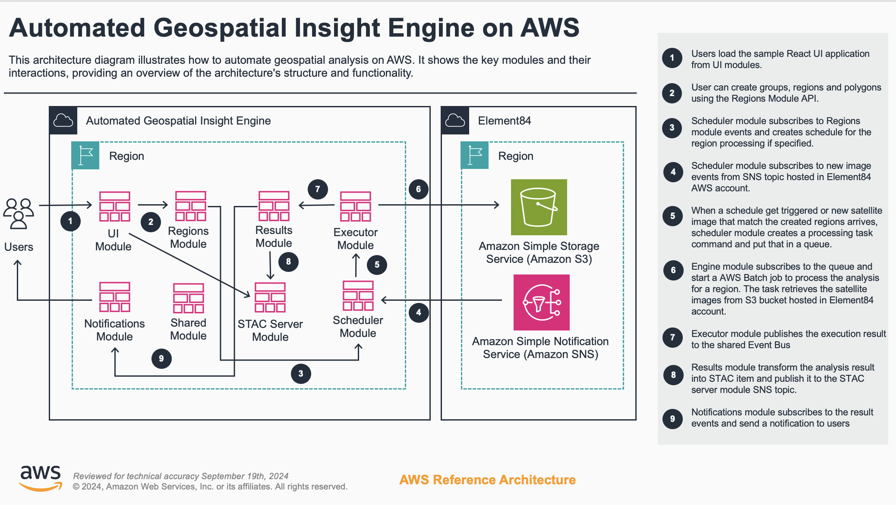

# **AGIE** (Automated Geospatial Insight Engine)

## Guidance Overview

Many industries depend upon intelligence and insights gained from earth observation data (satellite imagery, aerial imagery, remote sensing) and processed geospatial data, within their enterprise. Earth observation data, coupled with models (mechanistic and AI-powered), helps customers to improve demand and supply forecasting, automate risk management and mitigation workflows, improve customer outcomes, and improve their ability to meet regulatory requirements.



`AWS AGIE` removes the undifferentiated heavy lifting that customers face when designing, building, and implementing geospatial and earth observation image processing pipelines and related infrastructure. Common industries that benefit from earth observation and geospatial data processing and analytics include:

- Academia
- Agriculture
- Consumer Packaged Goods
- Energy, Power & Utilities
- Financial Services, Insurance, Finance, Trading, Hedging
- Geospatial
- OEM (Agriculture, Construction, Mining, Off-Road, On-Road, Irrigation, Autonomy, Steering and Guidance)
- Public Sector / Non-Governmental Organizations
- Retail
- Seed and Chemical Manufacturers
- Sustainability

To dive deep into AGIE components, please visit the following links:

- [Regions Module](typescript/packages/apps/regions)
- [Executor Module](typescript/packages/apps/executor)
- [Notifications Module](typescript/packages/apps/notifications)
- [Results Module](typescript/packages/apps/results)
- [Scheduler Module](typescript/packages/apps/scheduler)
- [Regions Extension Module](typescript/packages/apps/regions-extension)
- [UI Module](typescript/packages/apps/ui)

### Success

Upon successful deployment of this guidance, you will be able to do the following:

- Enroll polygons (areas of interest, farm fields, geographical areas of land) for processing and analysis
- Schedule the frequency of polygon analysis, for each polygon, to support one-time and recurring automated processing
- Automate the searching, downloading, clipping, and processing of earth observation data into NDVI maps and meta data, per polygon
- Customize, extend, and build upon existing earth observation index calculations to meet your specific use case requirements
- Search and access processed imagery and meta data via an API with user Authentication and Authorization
- Directly search and query processed imagery and meta data via the integrated AWS Services
- Establish customized alerts via Amazon SNS based upon meta data processed for each polygon
- Visualize processed imagery and meta data via an optional but integrated UI
- Integrate, customize, extend and augment existing workflows to achieve business goals

### Cost

You will need to pay for the AWS services used while running this guidance. As of September 2024, the cost for running this Guidance with the default settings in the US East (N. Virginia) is approximately $147.66 per month for analyzing 1000 polygons every 5 days as illustrated in the sample table below.

### Sample cost table

| Region                | Description                        | Service            | Monthly | Assumptions                                                                                                                                                                                                                                                                                                                                                                      |
|-----------------------|------------------------------------|--------------------|---------|----------------------------------------------------------------------------------------------------------------------------------------------------------------------------------------------------------------------------------------------------------------------------------------------------------------------------------------------------------------------------------|
| US East (N. Virginia) | STAC OpenSearch Server             | Amazon OpenSearch  | $93.69  | Number of instances (1), Storage for each Amazon OpenSearch Service instance (General Purpose SSD (gp3)),  Instance type (c5.large.search), Utilization (On-Demand only) (100 %Utilized/Month), Instance Node Type (Compute optimized), Storage Type (EBS Only), Pricing strategy (OnDemand), Nodes (1), Instance type (c5.large.search),Storage amount per volume (gp3) (20 GB) |
| US East (N. Virginia) | NAT Gateway                        | NAT Gateway        | $35.1   | Number of NAT Gateways (1)                                                                                                                                                                                                                                                                                                                                                       |
| US East (N. Virginia) | Satellite Image Processor ECS Task | AWS Fargate        | $11.85  | Operating system (Linux), CPU Architecture (x86), Average duration (2 minutes), Number of tasks or pods (6000 per month), Amount of memory allocated (2 GB), Amount of ephemeral storage allocated for Amazon ECS (20 GB)                                                                                                                                                        |
| US East (N. Virginia) | AGIE Modules Storage               | Amazon DynamoDB    | $5      | Table class (Standard), Average item size (all attributes) (1 KB), Data storage size (20 GB)                                                                                                                                                                                                                                                                                     |
| US East (N. Virginia) | Sentinel-2 New Scene Queue         | Amazon SQS         | $2      | DT Inbound: Not selected (0 TB per month), DT Outbound: All other regions (100 GB per month), Standard queue requests (1 million per month), Data transfer cost (2)                                                                                                                                                                                                              |
| US East (N. Virginia) | AGIE Modules API                   | Amazon API Gateway | $0.02   | Average size of each request (50 KB), Requests (20,000 per month)                                                                                                                                                                                                                                                                                                                |
| US East (N. Virginia) | AGIE Modules Lambda                | AWS Lambda         | $0      | Average size of each request (50 KB) Requests (50,000 per month)                                                                                                                                                                                                                                                                                                                 |
| Total                 |                                    |                    | $147.66 |                                                                                                                                                                                                                                                                                                                                                                                  |

## Prerequisites for Deployment

In order to deploy `AGIE` from your local workstation, you need to install the following dependencies:

- Active AWS Account
- [Node.js 20.x](https://nodejs.org/en/download/package-manager)
- [AWS Command Line Interface](https://aws.amazon.com/cli/)
- [Docker](https://docs.docker.com/engine/install/)
- [Rush.js](https://rushjs.io/)

> NOTE: AWS AGIE includes an optional UI module. The optional and integrated UI module includes functionality provided by Amazon Location Service. As of 7/24, Amazon Location Service is not available in certain AWS Regions, including us-west-1. Please review the most current list of Region availability of Amazon Location Service to ensure the optional UI module can be deployed within a Region that meets your company requirements.

## Deployment

### 1. Clone the solution

Run the following command to clone the solution repository into your local workstation:

```shell
git clone https://github.com/aws-solutions-library-samples/guidance-for-automated-geospatial-insights-engine-on-aws
cd guidance-for-automated-geospatial-insights-engine-on-aws
export AGIE_FOLDER=$PWD
export CLI_FOLDER="$PWD/typescript/packages/apps/cli"
```

### 2. Build the solution

Run the following command to install the solution dependencies and build it:

```shell
cd $AGIE_FOLDER
rush update
rush build
```

### 3. Deploy the solution

Setup some environment variables which will be referenced by rest of the commands. Replace the following variables with the actual value.

| Name                             | Description                                                                                                           |
|----------------------------------|-----------------------------------------------------------------------------------------------------------------------|
| AWS_REGION                       | AGIE's AWS Region deployment.                                                                                         |
| ENVIRONMENT                      | Environment (.e.g dev, stage or prod). You can have multiple environment deployed in the same AWS account and region. |

```shell
export ENVIRONMENT=<ENVIRONMENT>
export AWS_REGION=<AWS_REGION>
```

The installer will guide you through a list of configurable settings that you can apply to your environment deployment. Run the following command to start the installation of AGIE:

```shell
cd $CLI_FOLDER
bin/run.js install -e $ENVIRONMENT -r $AWS_REGION
```

The installer will generate `cdk.context.json` in the `infrastructure` folder. For the subsequent deployment, if you want to use same configuration and skip the installation wizard, run the following command:

```shell
cd $CLI_FOLDER
bin/run.js install -e $ENVIRONMENT -r $AWS_REGION -h -c "$AGIE_FOLDER/infrastructure/cdk.context.json"
```

### 4. Deployment Validation

To validate the deployment, open the CloudFormation console and verify the status of the following stacks

1. agie-\<ENVIRONMENT\>-shared
2. agie-\<ENVIRONMENT\>-regions
3. agie-\<ENVIRONMENT\>-stacServer
4. agie-\<ENVIRONMENT\>-regionsExtension
5. agie-\<ENVIRONMENT\>-notifications
6. agie-\<ENVIRONMENT\>-results
7. agie-\<ENVIRONMENT\>-ui
8. agie-\<ENVIRONMENT\>-engine
9. agie-\<ENVIRONMENT\>-scheduler
10. agie-\<ENVIRONMENT\>-executor

### 5. Set your initial password

Run the following command to set the password for the administrator user (replace the `ADMINISTRATOR_EMAIL` and `<PASSWORD>` with your own) :

```shell
export USER_POOL_ID=$(aws ssm get-parameter --name "/agie/$ENVIRONMENT/shared/cognitoUserPoolId" --query "Parameter.Value" --output text)

aws cognito-idp admin-set-user-password --user-pool-id $USER_POOL_ID  --username <ADMINISTRASTOR_EMAIL> --password <PASSWORD> --permanent
```

### 6. Walkthrough

Now that you have everything set up, visit [walkthrough](docs/walkthrough.md) to get started on working with `AGIE`.

## Next Steps

- Instead of relying on the container provided by AGIE, you can integrate your own custom image processing implementation into the application. This approach allows you to have greater control over the image processing functionality and tailor it to your specific requirements.
- To achieve optimal performance for the engine processor, it is recommended to fine-tune the Elastic Container Service (ECS) task size. By adjusting the task size, you can allocate the appropriate amount of compute resources (CPU and memory) to the engine processor, ensuring efficient utilization while avoiding over-provisioning or under-provisioning.
- The AGIE engine processor generates analysis results that are stored in the STAC (SpatioTemporal Asset Catalog) server and Amazon S3 (Simple Storage Service). By utilizing these processed results, you can unlock new opportunities to address your business needs and drive innovation within your organization.

## Cleanup

When deleting resources, please follow these steps:

```shell
cd $CLI_FOLDER
bin/run.js remove -e $ENVIRONMENT -r $AWS_REGION
```

Also, we've configured some resources not to be deleted automatically. Please follow these steps to delete them manually:

1. **Open the AWS Management Console**: Go to the AWS Management Console (<https://console.aws.amazon.com>) and sign in with your AWS credentials.

2. **Navigate to the S3 Service**: In the AWS Management Console, search for the "S3" service or select it from the list of services.

3. **List All S3 Buckets**: On the S3 dashboard, you'll see a list of all the S3 buckets in your AWS account. Locate all the buckets with `agie-<environment>` as the prefix.

   **Note**: S3 bucket names are globally unique across all AWS accounts, so the bucket name may not directly indicate its purpose or association with your CDK deployment. You may need to cross-reference the bucket name with the resources listed in your CDK application or CloudFormation stack.

4. **Empty the S3 Bucket**: Before you can delete an S3 bucket, you must first remove all objects (files and folders) inside the bucket. Select the bucket you want to empty, then click the "Empty" button.

   **Warning**: Emptying an S3 bucket permanently deletes all objects inside it. Double-check that you have selected the correct bucket before proceeding.

5. **Confirm the Bucket Empty Action**: A confirmation dialog will appear, asking you to enter the bucket name to confirm the action. Type the bucket name exactly as shown and click the "Empty" button to proceed.

6. **Wait for the Bucket to Empty**: The process of emptying an S3 bucket may take some time, depending on the number and size of objects in the bucket. Wait until the bucket is completely empty before proceeding to the next step.

7. **Delete the S3 Bucket**: Once the bucket is empty, right-click on the bucket name and select "Delete" from the context menu. Alternatively, you can select the bucket and click the "Delete" button at the top of the bucket list.

8. **Confirm the Bucket Deletion**: A confirmation dialog will appear, asking you to type the bucket name to confirm the deletion. Type the bucket name exactly as shown and click the "Delete bucket" button to proceed.

9. **Repeat for Other Buckets**: If you have multiple S3 buckets created by your CDK deployment that you want to delete, repeat steps 4-8 for each bucket.
