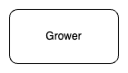
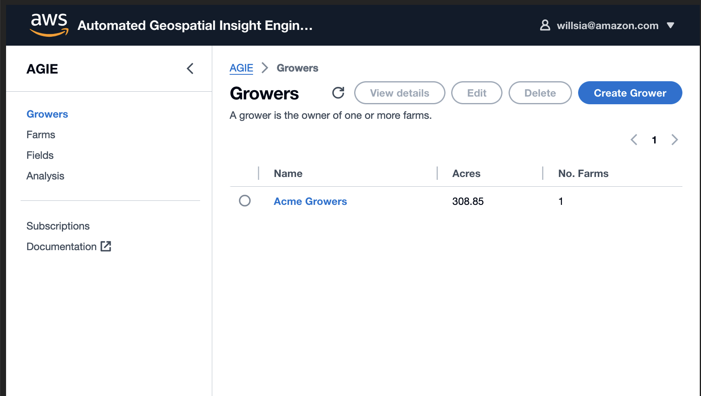
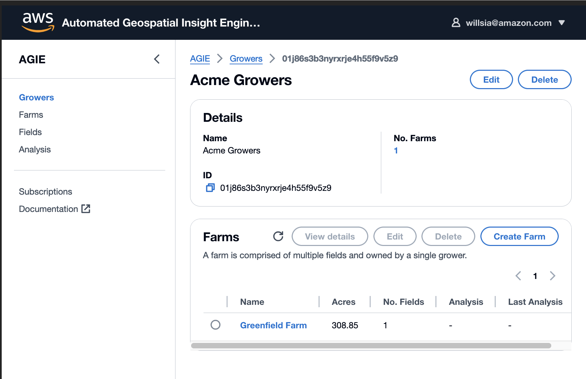
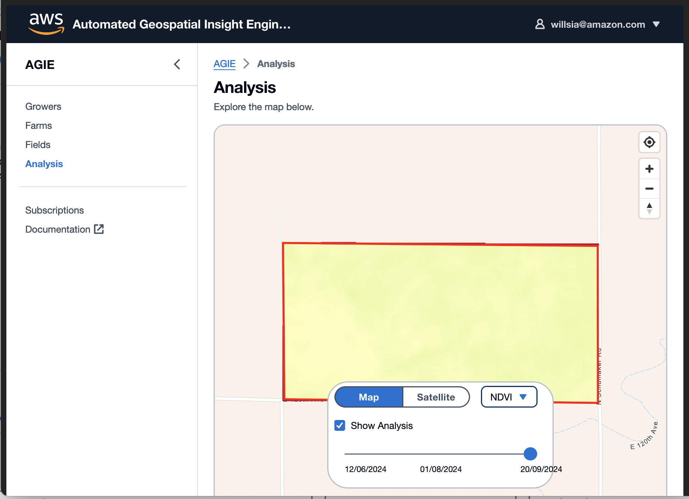

# Walkthrough

This guide assumes you have a fresh [installation](./deployment.md) of the AWS `AGIE`(Automated Geospatial Insight Engine) framework, and will walk through the steps from the initial setup right through to viewing the analysis result of the processing engine.

## Introduction

In recent years, the availability of high-resolution satellite imagery has revolutionized the way we monitor and analyze agricultural landscapes. By combining remote sensing techniques with advanced software tools, it is now possible to track Normalized Difference Vegetation Index (`NDVI`) values across vast areas, enabling accurate and timely assessments of soil conditions and vegetation health.

This walkthrough aims to guide you through the process of using `AGIE` to ingest satellite imagery and use it to calculate and visualize `NDVI` values for agricultural fields or regions of interest.

By following the step-by-step instructions, you will learn how to access and interpret satellite data, apply NDVI calculations, and generate insightful maps and reports that can inform decision-making processes in agriculture, land management, and environmental monitoring

1. Create Growers
2. Create Farms
3. Create Fields
4. Create Subscription to Fields Analysis Job
5. Schedule Analysis Job
6. View Analysis Result

Note that AGIE is a framework intended to be the foundation upon which you build your application on top. The framework includes an optional UI stack that demonstrates some of the backend modules capabilities that users can extend to fit their own requirements.

## Mapping AGIE to AgTech Domain

AGIE takes an agnostic approach to defining geospatial hierarchies to enable it to be applicable cross domains. As this walkthrough focuses on the AgTech domain, the following is how AGIE maps specifically to AgTech.

The `Regions` module manages AOIs (areas of interest) as a hierarchy of `Groups`, `Regions`, `Polygons`, and `States`.

To give a real world example of how this hierarchy is used, in AgTech a `Grower` is represented as a `Group`, a `Farm` as a `Region`, a `Field` as a `Polygon`, and a `Crop Season` as `State`.


<table>
<tr>
 <th colspan="2"> Description </th>
 <th colspan="2"> AgTech Example </th>
</tr>

<tr>
<td>


</td>
<td>

A `Group` is a logical collection of `Regions`, and is the highlest level of categorization within the hierarchy.

</td>
<td>



</td>
<td>

A `Grower` is the owner of one or multiple `Farms`.

</td>
</tr>

<tr>
<td>


</td>
<td>

A `Region` is a logical collection of `Polygons`. A `Region` belongs to a single `Group`, and can contain multiple `Polygons`.

</td>
<td>


</td>
<td>

A `Farm` is comprised of multiple `Fields`, and owned by a single `Grower`.

</td>
</tr>

<tr>
<td>


</td>
<td>

A `Polygon` represents the physical AOI defined by a set of coordinates. This is the level that geospatial analysis is performed.

A `Polygon` is part of a single `Region`, and can have multiple `States` over time.

</td>
<td>


</td>
<td>

A `Field` is a physical location within a `Farm` to be analysed, belonging to a single `Farm`.

</td>
</tr>

<tr>
<td>


</td>
<td>

A `State` represents the state of a `Polygon` at a specific TOI (time of interest). Multiple `States` representing different points in time can be associated with a `Polygon`.
</td>
<td>


</td>
<td>

A `Crop Season` provides details of the planted crop. Over time there can be multiple `Crop Seasons` associated with a `Field`.

</td>
</tr>
</table>

## Obtaining an authentication token

To use the `AGIE` modules REST API an authorization token, more specifically the `IdToken` token from Cognito, is required. To retrieve the id token, run the following command using the AGIE `CLI module`, replace `<PASSWORD>` with your actual password:

```shell
> cd $AGIE_FOLDER/typescript/packages/apps/cli
> bin/run.js auth -e $ENVIRONMENT -u $AGIE_ADMINISTRATOR_EMAIL -p <PASSWORD>
```

Save the output token to be used to authenticate with the AGIE REST API.

## Regions Module

> More details on the Regions Module can be found [here](../typescript/packages/apps/regions/README.md)


Retrieve the `REGIONS_MODULE_URL` by running the following command

```shell
aws cloudformation describe-stacks --stack-name "agie-$ENVIRONMENT-regions" --query 'Stacks[0].Outputs' --output json
```

### 1. Create the top level Group

Create a `Group` to represent a `Grower` named `Acme Growers`:

**Request:**

```http
POST <REGIONS_MODULE_URL>/groups
Content-Type: application/json
Accept-Version: 1.0.0
Accept: application/json
Authorization: Bearer <AUTH_TOKEN>

{
  "name": "Acme Growers"
}
```

**Example Response:**

```http
Content-Type: application/json
x-id: 01j16mxaxnnxcessmwv66xw87z

{
    "id": "01j16mxaxnnxcessmwv66xw87z",
    "name": "Acme Growers",
    "totalArea": 0,
    "totalRegions": 0,
    "createdBy": "someone@somewhere.com",
    "createdAt": "2024-06-25T02:51:59.798Z",
    "attributes": {},
    "tags": {}
}
```

### 2. Create a Region belonging to the Group

Create a `Region` to represent a `Farm` named `Greenfield Farm`. Replace `<GROUP_ID>` with the `id` of the created `Group`:

**Request:**

```http
POST <REGIONS_MODULE_URL>/groups/<GROUP_ID>/regions
Content-Type: application/json
Accept-Version: 1.0.0
Accept: application/json
Authorization: Bearer <AUTH_TOKEN>

{
    "name": "Greenfield Farm",
    "processingConfig": {
        "mode": "disabled"
    }
}
```

**Example Response:**

```http
Content-Type: application/json
x-id: 01j16mztr8eztq3bmbmzmphm3h

{
    "id": "01j16mztr8eztq3bmbmzmphm3h",
    "groupId": "01j16mxaxnnxcessmwv66xw87z",
    "name": "Greenfield Farm",
    "totalArea": 0,
    "totalPolygons": 0,
    "processingConfig": {
        "mode": "disabled",
        "priority": "standard"
    },
    "createdBy": "someone@somewhere.com",
    "createdAt": "2024-06-25T02:53:21.544Z",
    "attributes": {},
    "tags": {}
}
```

### 3. Create a Polygon belonging to the Region

Create a `Polygon` to represent a `Field` named `North field`. Replace `<REGION_ID>` with the `id` of the created `Region`.

**Request:**

```http
POST <REGIONS_MODULE_URL>/regions/<REGION_ID>/polygons
Content-Type: application/json
Accept-Version: 1.0.0
Accept: application/json
Authorization: Bearer <AUTH_TOKEN>

{
    "name": "North field",
    "boundary": [
        [
            [
                [
                    -104.5079674,
                    39.9194752
                ],
                [
                    -104.4894065,
                    39.9193435
                ],
                [
                    -104.4893912,
                    39.9122295
                ],
                [
                    -104.5078877,
                    39.9123941
                ],
                [
                    -104.5079674,
                    39.9194752
                ]
            ]
        ]
    ]
}
```

**Example Response:**

Note in the response, `area` is automatically created on the provided `boundary` and any specified `exclusions`.

```http
Content-Type: application/json
x-id: 01j16n5fc94t165a5h8tvh5jhg

{
    "id": "01j16n5fc94t165a5h8tvh5jhg",
    "name": "North field",
    "regionId": "01j16mztr8eztq3bmbmzmphm3h",
    "groupId": "01j16mxaxnnxcessmwv66xw87z",
    "boundary": [
        [
            [
                [
                    -104.5079674,
                    39.9194752
                ],
                [
                    -104.4894065,
                    39.9193435
                ],
                [
                    -104.4893912,
                    39.9122295
                ],
                [
                    -104.5078877,
                    39.9123941
                ],
                [
                    -104.5079674,
                    39.9194752
                ]
            ]
        ]
    ],
    "area": 308.84632962631275,
    "createdBy": "someone@somewhere.com",
    "createdAt": "2024-06-25T02:56:26.505Z",
    "attributes": {},
    "tags": {}
}
```

### 4. Set the State of a Polygon

Create a `State` to represent a `Crop Season` for a specific field. Replace `<POLYGON_ID>` with the `id` of the created `Polygon`.

In this step we are using `tags` and `attributes` to store additional data unique to our use case. Here we are adding `crop` and `plantDate` as `tags` so that we can filter by them later, and adding `targetYield` as an `attribute`.

**Request:**

```http
POST <REGIONS_MODULE_URL>/polygons/<POLYGON_ID>/states
Content-Type: application/json
Accept-Version: 1.0.0
Accept: application/json
Authorization: Bearer <AUTH_TOKEN>

{
  "timestamp": "2024-03-21T03:47:32.452Z",
  "tags": {
    "crop": "corn",
    "plantDate": "2024-04-01T00:00:00.000Z"
  },
  "attributes": {
    "targetYield": 1342
  }
}
```

**Example Response:**

```http
Content-Type: application/json
x-id: 01hwke0d3f03j7rtyjna7npdj8

{
    "id": "01j16nf0mkemwj0vgwdv5r64ds",
    "polygonId": "01j16n5fc94t165a5h8tvh5jhg",
    "regionId": "01j16mztr8eztq3bmbmzmphm3h",
    "groupId": "01j16mxaxnnxcessmwv66xw87z",
    "timestamp": "2024-03-21T03:47:32.452Z",
    "createdBy": "someone@somewhere.com",
    "createdAt": "2024-06-25T03:01:39.091Z",
    "attributes": {
        "targetYield": 1342
    },
    "tags": {
        "crop": "corn",
        "plantDate": "2024-04-01T00:00:00.000Z"
    }
}
```

### 5. Viewing the hierarchy

You now have a `Group` / `Region` / `Polygon` / `State` hierarchy in place. Try these different REST calls to view your data:

**Request:** Return all groups.

```http
GET <REGIONS_MODULE_URL>/groups
Accept-Version: 1.0.0
Accept: application/json
Authorization: Bearer <AUTH_TOKEN>
```

**Request:** Return all regions belonging to a specific group.

```http
GET <REGIONS_MODULE_URL>/regions?groupId=<GROUP_ID>
Accept-Version: 1.0.0
Accept: application/json
Authorization: Bearer <AUTH_TOKEN>
```

**Request:** Return all polygons belonging to a specific region.

```http
GET <REGIONS_MODULE_URL>/polygons?regionId=<REGION_ID>
Accept-Version: 1.0.0
Accept: application/json
Authorization: Bearer <AUTH_TOKEN>
```

**Request:** Return a specific polygon, along with its current state.

```http
GET <REGIONS_MODULE_URL>/polygons/<POLYGON_ID>?includeLatestState=true
Accept-Version: 1.0.0
Accept: application/json
Authorization: Bearer <AUTH_TOKEN>
```

**Request:** View all State history for a specific Polygon.

```http
GET <REGIONS_MODULE_URL>/states?polygonId=<POLYGON_ID>
Accept-Version: 1.0.0
Accept: application/json
Authorization: Bearer <AUTH_TOKEN>
```

## Notifications Module

> More details on the Notification Module can be found [here](../typescript/packages/apps/notifications/README.md)

Retrieve the `NOTIFICATIONS_MODULE_URL` by running the following command

```shell
aws cloudformation describe-stacks --stack-name "agie-$ENVIRONMENT-notifications" --query 'Stacks[0].Outputs' --output json
```

### 1. Create a Subscription for a Region

Create a `Subcription` for all `Notifications` for a specific `Region` . Replace `<REGION_ID>` with the `id` of the created `Region`. `Notifications`API uses the user's email as the notification target for the subscription.

In a test environment, to allow SNS to send notification to `AGIE` users, you have to [add and verify the user's mobile number](https://docs.aws.amazon.com/sns/latest/dg/sns-sms-sandbox-verifying-phone-numbers.html) in the SMS sandbox.

**Request:**

```http
POST <NOTIFICATIONS_MODULE_URL>/regions/<REGION_ID>/subscriptions
Content-Type: application/json
Accept-Version: 1.0.0
Accept: application/json
Authorization: Bearer <AUTH_TOKEN>

{}
```

**Example Response:**

```http
Content-Type: application/json
x-id: 01hwke0d3f03j7rtyjna7npdj8

{
    "id": "01j16nyf7wcps0s4b4shd51mma",
    "regionId": "01j16mztr8eztq3bmbmzmphm3h",
    "createdAt": "2024-06-25T03:10:05.564Z"
}
```

### 2. Viewing the Subscriptions

```http
GET <NOTIFICATIONS_MODULE_URL>/subscriptions
Accept-Version: 1.0.0
Accept: application/json
Authorization: Bearer <AUTH_TOKEN>
```

## Scheduler Module

> More details on the Scheduler Module can be found [here](../typescript/packages/apps/scheduler/README.md)

When analyzing a specific Region, you have three options for executing the engine:

1. **On-Demand Mode**: Configure the engine to run automatically whenever new satellite imagery becomes available for that Region. This mode is referred to as the onNewScene mode.
2. **Rate Scheduled Mode**: Set up a recurring schedule to run the analysis at regular intervals, regardless of new imagery availability. This mode allows you to define a fixed rate (or one-time schedule) for executing the engine.
3. **One Time Scheduled Mode**: Set up a one time schedule to run the analysis.


### 1. Configure a `one-time` schedule for the `Region` engine processing

You configure a one-time schedule using an `at expression`. An `at expression` consists of the date and time at which you want AGIE Scheduler to invoke your schedule, as shown in the following.

In this walkthrough, we will create a one-time schedule to start analysis so we can view the results.

```http
PATCH <REGIONS_MODULE_URL>/regions/<REGION_ID>
Content-Type: application/json
Accept-Version: 1.0.0
Accept: application/json
Authorization: Bearer <AUTH_TOKEN>

{
    "processingConfig": {
        "scheduleExpression": "at(yyyy-mm-ddThh:mm:ss)",
        "scheduleExpressionTimezone": "Australia/Perth",
        "mode": "scheduled"
    }
}
```

### 2. Configure an `onNewScene` schedule for the `Region` engine processing

```http
PATCH <REGIONS_MODULE_URL>/regions/<REGION_ID
Content-Type: application/json
Accept-Version: 1.0.0
Accept: application/json
Authorization: Bearer <AUTH_TOKEN>

{
    "processingConfig": {
        "mode": "onNewScene"
    }
}
```

### 3. Configure a `rate-based` schedule for the `Region` engine processing

| Name     | Description                                                                                                                            |
|----------|----------------------------------------------------------------------------------------------------------------------------------------|
| value    | A positive number.                                                                                                                     |
| unit     | The unit of time you want your schedule to invoke it's target.<br/>Valid inputs: `minutes, hours or days`.                             |
| timezone | Time zone identifier. The `TZ identifier` column from this [table](https://en.wikipedia.org/wiki/List_of_tz_database_time_zones#List). |

```http
PATCH <REGIONS_MODULE_URL>/regions/<REGION_ID>
Content-Type: application/json
Accept-Version: 1.0.0
Accept: application/json
Authorization: Bearer <AUTH_TOKEN>

{
    "processingConfig": {
        "scheduleExpression": "rate(<value> <unit>)",
        "scheduleExpressionTimezone": "<timezone>",
        "mode": "scheduled"
    }
}
```

## Results Module


Retrieve the `RESULTS_MODULE_URL` by running the following command

```shell
aws cloudformation describe-stacks --stack-name "agie-$ENVIRONMENT-results" --query 'Stacks[0].Outputs' --output json
```

### 1. List all the analysis `Results` of a Region

When the one-time schedule had been triggered, you should be able to list the analysis results of the regions.

```http
GET <RESULTS_MODULE_URL>/regions/<REGION_ID>/results
Accept-Version: 1.0.0
Accept: application/json
Authorization: Bearer <AUTH_TOKEN>
```

**Example Response:**

```http
Content-Type: application/json
x-id: 01j16hd6y1fm1rbkwdckck6z54

{
    "results": [
        {
            "regionId": "01j16mztr8eztq3bmbmzmphm3h",
            "id": "01j16hd6y1fm1rbkwdckck6z54",
            "createdAt": "2024-06-25T01:50:48.246Z",
            "engineType": "aws-batch",
            "status": "succeeded",
            "executionId": "01c2d407-4a4b-42fd-afed-d71b0366390b",
            "updatedAt": "2024-06-25T01:52:02.491Z",
            "message": "Essential container in task exited"
        }
    ],
    "pagination": {
        "count": 20
    }
}
```

Wait until the execution result returns `succeeded`.

## AGIE STAC Server

> More details on the STAC server can be found [here](../typescript/packages/apps/results/README.md#stac-api).

Retrieve the `STAC_SERVER_URL` by running the following command

```shell
aws cloudformation describe-stacks --stack-name "agie-$ENVIRONMENT-stacServer" --query 'Stacks[0].Outputs' --output json
```

### Authentication

The AGIE `STAC API` Gateway is protected with IAM Authentication. You will need an [IAM principals](https://docs.aws.amazon.com/apigateway/latest/developerguide/api-gateway-control-access-using-iam-policies-to-invoke-api.html) that has permission to invoke the API Gateway.

Follow this [instruction](https://learning.postman.com/docs/sending-requests/authorization/aws-signature/) to configure Postman to invoke API with AWS Signature Authentication.

### 1. Search for `STAC` items generated by AGIE

To search for regions in the region collection, specify `agie-region` as the collection parameters, and then specify your search criteria following the [specification](https://github.com/stac-api-extensions/collection-search).

**Request:** Return all regions that intersect with the bounding box.

```http
POST <STAC_SERVER_URL>/search
Accept-Version: 1.0.0
Accept: application/json
Authorization: <SIGNED_AWS_API_REQUEST>
{
    "collections": [
        "agie-region"
    ],
    "query": {
        "bbox": [
            -104.5079674,
            39.9122295,
            -104.4893912,
            39.9194752
        ]
    }
}
```

To search for polygon generated by analysis job, specify `agie-polygon` as the collection parameters

**Request:** Return all polygons associated with a specific region.

```http
POST <STAC_SERVER_URL>/search
Accept-Version: 1.0.0
Accept: application/json
Authorization: <SIGNED_AWS_API_REQUEST>
{
    "collections": [
        "agie-polygon"
    ],
    "query": {
        "agie:regionId": {
            "eq": "01j1c3naehgkvxk6fkkcsrcznq"
        }
    }
}
```


## UI Module

### 1. Launch the UI

Run the following command to retrieve the UI URL:

```shell
export AGIE_WEB_URL=$(aws ssm get-parameter --name "/agie/$ENVIRONMENT/ui/websiteUrl" --query "Parameter.Value" --output text) && echo "https://$AGIE_WEB_URL"
```

Use the administrator's email and password set on the deployment step to log in to the demo UI.

### 2. List growers

Click on the `Growers` on the left menu bar to view the list of growers that we had just created.



### 3. List farms associated with a grower

To view the list of farms associated with a grower, click on `Acme Growers` on the Growers table shown in the previous step.



Notice that each grower also contains the last execution result. `Regions Extension` module subscribes to events from `Result` module and augment the Farm resource with the latest execution.

> More details on the `Regions Extension` module can be found [here](../typescript/packages/apps/regions-extension/README.md)

### 4. List fields associated with a farm

To view the list of field associated with a farm, click on `Greenfield Farm` on the Farms table shown in the previous step.


### 5. View the analysis result of a farm

Click on the `Analysis` link on the left menu to view the analysis result for the region. Toggle the drop-down band list to view the different band images.



Click on the field area to view the `NDVI` calculation statistic.


More details on the `UI` module can be found [here](../typescript/packages/apps/ui/README.md)
