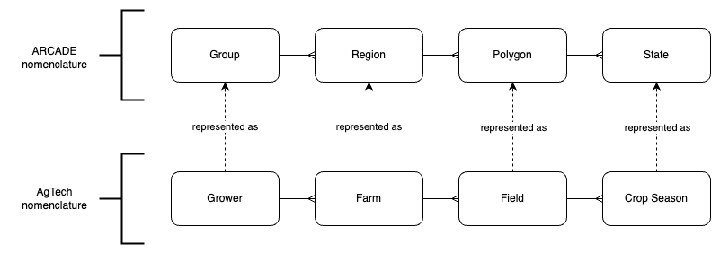
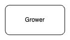
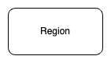
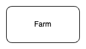
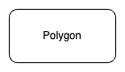
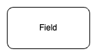
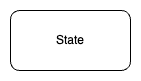
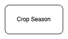

# Regions Module

## Overview

The _regions module_ manages AOIs (areas of interest) as a hierarchy of `Groups`, `Regions`, `Polygons`, and `States`.

To give a real world example of how this hierarchy is used, in AgTech a `Grower` is represented as a `Group`, a `Farm` as a `Region`, a `Field` as a `Polygon`, and a `Crop Season` as `State`.



<table>
<tr>
 <th colspan="2"> Description </th>
 <th colspan="2"> AgTech Example </th>
</tr>

<tr>
<td>


</td>
<td>

A `Group` is a logical collection of `Regions`, and is the highlest level of categorization within the hierarchy.

</td>
<td>



</td>
<td>

A `Grower` is the owner of one or multiple `Farms`.

</td>
</tr>

<tr>
<td>



</td>
<td>

A `Region` is a logical collection of `Polygons`. A `Region` belongs to a single `Group`, and can contain multiple `Polygons`.

</td>
<td>



</td>
<td>

A `Farm` is comprised of multiple `Fields`, and owned by a single `Grower`.

</td>
</tr>

<tr>
<td>



</td>
<td>

A `Polygon` represents the physical AOI defined by a set of coordinates. This is the level that geospatial analysis is performed.

A `Polygon` is part of a single `Region`, and can have multiple `States` over time.

</td>
<td>



</td>
<td>

A `Field` is a physical location within a `Farm` to be analysed, belonging to a single `Farm`.

</td>
</tr>

<tr>
<td>



</td>
<td>

A `State` represents the state of a `Polygon` at a specific TOI (time of interest). Multiple `States` representing different points in time can be associated with a `Polygon`.
</td>
<td>



</td>
<td>

A `Crop Season` provides details of the planted crop. Over time there can be multiple `Crop Seasons` associated with a `Field`.

</td>
</tr>
</table>

## Walkthrough

The following walkthrough describes how to create a `Group` /  `Region` / `Polygon` / `State` hierarchy. The theme of this walkthrough will be AgTech, therefore the hierarchy we create will represent a hierarchy of `Grower`, `Farm`, `Field`, along with `Crop Season`.

A collection of the available REST API endpoints and requests is [provided](./docs/regions.insomnia.json) that can be imported into [Insomnia](https://insomnia.rest/products/insomnia). This collection was automatically created by importing the provided [swagger](./docs/swagger.json) - the same approach can be used with other REST clients, such as [Postman](https://www.postman.com/product/rest-client/), if Insomnia is not used.

### i. Set up Authentication

To use the _regions module_ REST API an authorization token, more specifically the `IdToken` token from Cognito, is required. An example of retrieving one using the AWS CLI is as follows. Ensure the `???` placeholders are replaced with valid configuration:

> TODO: replace this with something more user friendly, e.g. auth via UI

```shell
> aws cognito-idp admin-initiate-auth \
  --user-pool-id ??? \
  --client-id ??? \
  --auth-flow ADMIN_USER_PASSWORD_AUTH \
  --auth-parameters USERNAME=???,PASSWORD=??? \
  | jq -r '.AuthenticationResult.IdToken'
```

In all the sample requests following, replace `<AUTH_TOKEN>` with the `IdToken`.

### ii. Create the top level Group

Create a `Group` to represent a `Grower` named `Acme Growers`:

**Request:**

```http
POST /groups
Content-Type: application/json
Accept-Version: 1.0.0
Accept: application/json
Authorization: Bearer <AUTH_TOKEN>

{
  "name": "Acme Growers"
}
```

**Example Response:**

```http
Content-Type: application/json
x-id: 01hwke02ka7y9hh5ek8dvn0n62

{
  "id": "01hwke02ka7y9hh5ek8dvn0n62",
  "name": "Acme Growers",
  "createdBy": "someone@somewhere.com",
  "createdAt": "2024-04-28T22:42:48.042Z"
}
```

### iii. Create a Region belonging to the Group

Create a `Region` to represent a `Farm` named `Greenfield Farm`. Replace `<GROUP_ID>` with the `id` of the created `Group`:

**Request:**

```http
POST /groups/<GROUP_ID>/regions
Content-Type: application/json
Accept-Version: 1.0.0
Accept: application/json
Authorization: Bearer <AUTH_TOKEN>

{
  "name": "Greenfield Farm"
}
```

**Example Response:**

```http
Content-Type: application/json
x-id: 01hwke0d3f03j7rtyjna7npdj8

{
  "id": "01hwke0d3f03j7rtyjna7npdj8",
  "groupId": "01hwke02ka7y9hh5ek8dvn0n62",
  "name": "Greenfield Farm",
  "createdBy": "someone@somewhere.com",
  "createdAt": "2024-04-28T22:42:48.042Z"
}
```

### iii. Create a Polygon belonging to the Region

Create a `Polygon` to represent a `Field` named `North field`. Replace `<REGION_ID>` with the `id` of the created `Region`.

**Request:**

```http
POST /regions/<REGION_ID>/polygons
Content-Type: application/json
Accept-Version: 1.0.0
Accept: application/json
Authorization: Bearer <AUTH_TOKEN>

{
  "name": "North field",
  "boundary": [
    [-104.5079674, 39.9194752],
    [-104.4894065, 39.9193435],
    [-104.4893912, 39.9122295],
    [-104.5078877, 39.9123941],
    [-104.5079674, 39.9194752]
  ]
}
```

**Example Response:**

Note in the response, `area` is automatically created on the provided `boundary` and any specified `exclusions`.

```http
Content-Type: application/json
x-id: 01hwke0d3f03j7rtyjna7npdj8

{
  "id": "u0j9sgt5nvxc1kx7dj3ejhmr8f",
  "groupId": "01hwke02ka7y9hh5ek8dvn0n62",
  "regionId": "01hwke0d3f03j7rtyjna7npdj8",
  "name": "North field",
  "boundary": [
    [-104.5079674, 39.9194752],
    [-104.4894065, 39.9193435],
    [-104.4893912, 39.9122295],
    [-104.5078877, 39.9123941],
    [-104.5079674, 39.9194752]
  ],
  "area": 123.3,
  "createdBy": "someone@somewhere.com",
  "createdAt": "2024-04-28T22:42:48.042Z"
}
```

### iv. Set the State of a Polygon

Create a `State` to represent a `Crop Season` for a specific field. Replace `<POLYGON_ID>` with the `id` of the created `Polygon`.

Every kind of resource within the _regions module_ has a concept of `tags` and `attributes`. Both represent user-defined fields, with the difference being `tags` may be filtered by their values when searching.

In this step we are using `tags` and `attributes` to store additional data unique to our use case. Here we are adding `crop` and `plantDate` as `tags` so that we can filter by them later, and adding `targetYield` as an `attribute`.

**Request:**

```http
POST /polygons/<POLYGON_ID>/states
Content-Type: application/json
Accept-Version: 1.0.0
Accept: application/json
Authorization: Bearer <AUTH_TOKEN>

{
  "timestamp": "2024-03-21T03:47:32.452Z",
  "tags": {
    "crop": "corn",
    "plantDate": "2024-04-01T00:00:00.000Z"
  },
  "attributes": {
    "targetYield":1342
  }
}
```

**Example Response:**

```http
Content-Type: application/json
x-id: 01hwke0d3f03j7rtyjna7npdj8

{
  "id": "q5lwcfqfgnevnpqe3osny7n552",
  "groupId": "01hwke02ka7y9hh5ek8dvn0n62",
  "regionId": "01hwke0d3f03j7rtyjna7npdj8",
  "polygonId": "u0j9sgt5nvxc1kx7dj3ejhmr8f",
  "timestamp": "2024-03-21T03:47:32.452Z",
  "tags": {
    "crop": "corn",
    "plantDate": "2024-04-01T00:00:00.000Z"
  },
  "attributes": {
    "targetYield":1342
  },
  "createdBy": "someone@somewhere.com",
  "createdAt": "2024-04-28T22:42:48.042Z"
}
```

## v. Viewing the hierarchy

You now have a `Group` / `Region` / `Polygon` / `State` hierarchy in place. Try these different REST calls to view your data:

**Request:** Return all groups.

```http
GET /groups
Accept-Version: 1.0.0
Accept: application/json
Authorization: Bearer <AUTH_TOKEN>
```

**Request:** Return all regions belonging to a specific group.

```http
GET /regions?groupId=<GROUP_ID>
Accept-Version: 1.0.0
Accept: application/json
Authorization: Bearer <AUTH_TOKEN>
```

**Request:** Return all polygons belonging to a specific region.

```http
GET /polygons?regionId=<REGION_ID>
Accept-Version: 1.0.0
Accept: application/json
Authorization: Bearer <AUTH_TOKEN>
```

**Request:** Return a specific polygon, along with its current state.

```http
GET /polygons/<POLYGON_ID>?includeLatestState=true
Accept-Version: 1.0.0
Accept: application/json
Authorization: Bearer <AUTH_TOKEN>
```

**Request:** View all State history for a specific Polygon.

```http
GET /states/?polygonId=<POLYGON_ID>
Accept-Version: 1.0.0
Accept: application/json
Authorization: Bearer <AUTH_TOKEN>
```

## Architecture

### ARCADE Conceptual Architecture


The _regions module_ is intended to be orchestrated by a _UI_, or some other application or system, e.g. a _UI_ could provide the ability for users to manage these hierarchies manually, or an _application_ could be written that defines the hierarchies by importing from another system.

When any part of the hierarchy changes, the _regions module_ publishes events. Within ARCADE, the _scheduler module_ subscribes to `Region` change events to process any changes to its job processing schedule.

### Regions Logical Architecture


The _regions module_ provides a REST API (see [swagger](./docs/swagger.json)) to enable the management of groups, regions, polygons, and states. The REST API is implemented as a fat lambda that is proxied via API Gateway.

API Gateway utilizes Cognito for authentication, and Verified Permissions for authorization. Currently, authorization is performed at the REST API endpoint level (e.g. only `admin`'s allowed to `POST`), but the use of Verified Permissions allows this to be extended to FGAC (fine-grained access control) if needed in the future.

DynamoDB is used as the datastore. A single table design is taken, with composite keys, GSI overloading, and GSI sharding. Refer to [DynamoDB design doc](./docs/DynamoDB%20design.md) for further details.

## Application Events

Upon any type of change event ('created', 'updated', 'deleted') of any resource ('Group', 'Region', 'Polygon', 'State'), an event is published to EventBridge. An example is as follows:

```json
{
  "version": "0",
  "id": "b06dbe5c-19bc-4244-ac3d-84ced74e53e6",
  "detail-type": "com.aws.arcade.regions>Group>updated",
  "source": "com.aws.arcade.regions",
  "account": "111122223333",
  "time": "2014-04-22T18:43:48Z",
  "detail": {
  "eventType": "updated",
  "id": "ab6gtsfabc61",
  "resourceType": "Group",
  "old": {
    // resource attributes before the update
  },
  "new": {
    // resource attributes after the update
  }
}
```

Of interest here:

- `detail-type` is comprised of `com.aws.arcade.regions>:resourceType>:eventType`.
- `source` is the identifier of the module -  `com.aws.arcade.regions`.
- `eventType` is one of `created`, `updated`, or `deleted`.
- `resourceType` is one of `Group`, `Region`, `Polygon`, or `State`.
- `old` is provided when `eventType` is `updated` or `deleted`.
- `new` is provided when `eventType` is `created` or `updated`.
